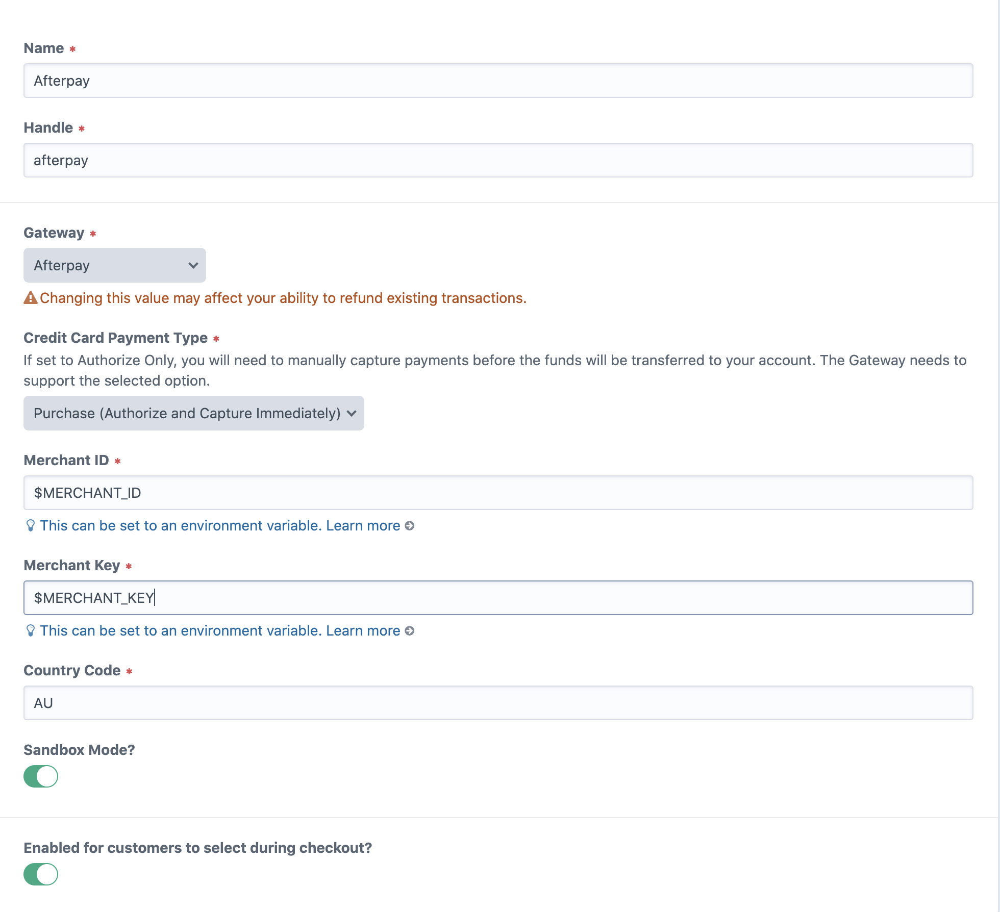

# Configuration

Within the settings page, you'll be able to set:
- Payment Type (purchase or manual)
- Merchant ID
- Merchant Key
- Country Code 
- Sandbox mode

Both the ID and Key can be set as environment variables in your `.env` file.

